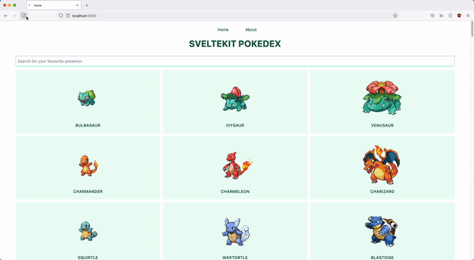

# Svelte Pokedex

A simple webapp that uses PokeAPI & SvelteKit to show the deatils of pokemon.

## Installation

After cloning the repo:

Install svelte-pokedex with npm

```bash
  npm install
  npm run dev
```

Install svelte-pokedex with yarn

```bash
  yarn # you can use 'yarn install' as well
  yarn run dev
```

## Demo



## Tech Stack

**Client:** SvelteKit, Redux, TailwindCSS

**API:** PokeAPI

## Acknowledgements

- [James Q Quick's Video](https://www.youtube.com/watch?v=UU7MgYIbtAk)
- [Svelte Kit](https://kit.svelte.dev)
- [Svelte](https://svelte.dev)

## Deployment status

[](https://app.netlify.com/sites/sveltidex-lemokami/deploys)
